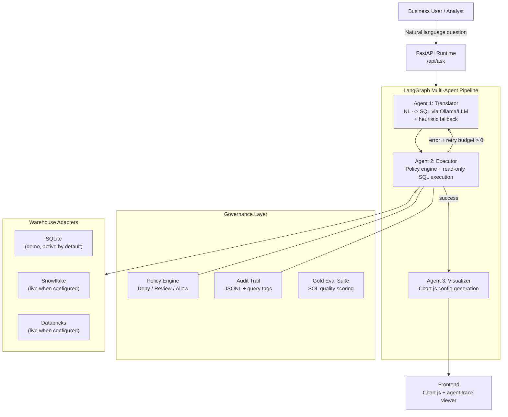

<h1 align="center">Nexus-Hive</h1>

<p align="center">
  <strong>Multi-agent NL-to-SQL copilot with governed analytics, audit trails, and multi-warehouse support</strong>
</p>

<p align="center">
  <a href="https://github.com/KIM3310/Nexus-Hive/actions/workflows/ci.yml"></a>
  <a href="https://codecov.io/gh/KIM3310/Nexus-Hive"></a>
  <a href="https://www.python.org/downloads/"></a>
  <a href="LICENSE"></a>
  <a href="https://fastapi.tiangolo.com"></a>
</p>

---

Nexus-Hive turns natural-language business questions into **audited SQL**, executes them safely against a warehouse, and returns **chart-ready answers with a full agent trace**. Every step -- translation, policy check, execution, visualization -- is independently inspectable, testable, and governed.

**Why this matters:** Most NL-to-SQL tools generate SQL and run it. Nexus-Hive inserts a policy engine, audit trail, and retry loop between generation and execution -- making it safe for environments where data access requires governance.

---

## Architecture



The pipeline is built with **LangGraph** as a compiled state graph. Each agent is a node with typed state (`AgentState`), connected by edges with conditional routing. When the Executor rejects SQL (policy denial or execution error), the graph routes back to the Translator for correction -- up to 3 retries -- without re-running the Visualizer.

---

## Quick Start

### Local (3 commands)

```bash
git clone https://github.com/KIM3310/Nexus-Hive.git && cd Nexus-Hive
make install                 # creates venv, installs deps
python3 seed_db.py           # seeds 10k enterprise sales records into SQLite
make run                     # starts uvicorn on http://localhost:8000
```

Open [http://localhost:8000](http://localhost:8000) for the frontend, or [http://localhost:8000/docs](http://localhost:8000/docs) for Swagger UI.

### Docker

```bash
docker compose up app
# With live LLM inference via Ollama:
docker compose --profile with-ollama up
docker exec nexus-hive-ollama ollama pull phi3
```

### Verify Everything Works

```bash
make verify   # runs lint + pytest + smoke test against a live server
```

---

## Tech Stack

| Layer | Technology | Role |
|-------|-----------|------|
| **API Framework** | FastAPI 0.115+ | Async HTTP, OpenAPI docs, middleware |
| **Agent Orchestration** | LangGraph + LangChain Core | State graph, conditional edges, typed agent state |
| **LLM Runtime** | Ollama (phi3 default) | Local inference for SQL generation + chart config |
| **Policy Engine** | Custom Python | Deny/review/allow decisions, sensitive column gating |
| **Warehouse (Demo)** | SQLite + Pandas | Zero-config local execution with 10k seeded records |
| **Warehouse (Prod)** | Snowflake, Databricks | Live adapters via `snowflake-connector-python` / `databricks-sdk` |
| **Visualization** | Chart.js | Bar, line, pie, doughnut charts from query results |
| **Security** | HMAC-signed cookies, RBAC | Operator sessions, token auth, role-based column gating |
| **Resilience** | Circuit Breaker | Ollama failure isolation with auto-recovery |
| **Infrastructure** | Docker, Kubernetes, Terraform | Container, K8s manifests, GCP Cloud Run via Terraform |
| **CI/CD** | GitHub Actions | Lint (ruff), test (pytest + coverage), Docker build |

---

## Multi-Warehouse Support

| Adapter | Status | Gated By | Execution Mode |
|---------|--------|----------|----------------|
| **SQLite** (demo) | Active by default | -- | `local-sqlite` |
| **Snowflake** | Live when configured | `SNOWFLAKE_ACCOUNT` env var | `snowflake-live` |
| **Databricks** | Live when configured | `DATABRICKS_HOST` + auth | `databricks-live` |

All adapters implement the same 5-method interface (`get_schema`, `run_scalar_query`, `fetch_date_window`, `build_table_profiles`, `execute_sql_preview`) and return results in an identical format. The Executor node and Visualizer node never branch on adapter type. See [ADR-002](docs/adr/002-warehouse-adapter-abstraction.md) for the design rationale.

---

## Governance Features

| Feature | Description | Endpoint |
|---------|------------|----------|
| **Policy Engine** | Deny write ops, block `SELECT *`, gate sensitive columns by role, flag non-aggregated queries for review | `POST /api/policy/check` |
| **Audit Trails** | Every query logged with request ID, role, policy verdict, adapter, execution time | `GET /api/query-audit/recent` |
| **Query Tags** | Structured tags mapping onto Snowflake `QUERY_TAG` and Databricks warehouse tag conventions | `GET /api/schema/query-tag` |
| **Session Boards** | Operator surfaces for pending reviews, approval histories, query throughput | `GET /api/query-session-board` |
| **Gold Evals** | Built-in evaluation suite scoring generated SQL against expected feature patterns | `GET /api/evals/nl2sql-gold/run` |
| **Approval Workflows** | Review-required queries produce actionable approval bundles | `GET /api/query-approval-board` |

---

## Core API

```bash
# Ask a question (returns stream URL for agent trace)
curl -X POST http://localhost:8000/api/ask \
  -H "Content-Type: application/json" \
  -d '{"question": "Show total net revenue by region"}'

# Stream agent trace (SSE)
curl -N "http://localhost:8000/api/stream?q=Show+total+net+revenue+by+region&rid=REQUEST_ID"

# Policy check -- preview SQL before execution
curl -X POST http://localhost:8000/api/policy/check \
  -H "Content-Type: application/json" \
  -d '{"sql": "SELECT region_name, SUM(net_revenue) FROM sales GROUP BY region_name", "role": "analyst"}'

# Runtime metadata
curl http://localhost:8000/api/meta

# Run gold eval suite
curl http://localhost:8000/api/evals/nl2sql-gold/run
```

Interactive docs: [http://localhost:8000/docs](http://localhost:8000/docs) (Swagger) | [http://localhost:8000/redoc](http://localhost:8000/redoc) (ReDoc)

---

## Test Results and Benchmarks

> From pytest 8.3.5 on Python 3.11 -- `make verify` (lint + test + smoke)

| Metric | Value |
|--------|-------|
| Test files | 8 |
| Total test cases | 80+ |
| Policy engine tests | 38 (deny, review, allow, sensitive columns, query tags) |
| Agent orchestration tests | 12 (translator, executor, visualizer, routing) |
| API endpoint tests | 15 (health, meta, ask, policy, audit, schema) |
| SQL validation tests | 9 (read-only enforcement, injection blocking) |
| Circuit breaker tests | 6 (state transitions, timeout recovery) |

### Endpoint Response Times (local SQLite)

| Endpoint | Avg Response |
|----------|-------------|
| `GET /health` | 21 ms |
| `GET /api/meta` | 16 ms |
| `GET /api/runtime/brief` | 42 ms |
| `GET /api/evals/nl2sql-gold/run` | 9 ms |
| `GET /api/schema/*` | < 1 ms |

---

## Warehouse Setup

### Snowflake

```bash
pip install -e ".[snowflake]"
export SNOWFLAKE_ACCOUNT=your_account.us-east-1
export SNOWFLAKE_USER=your_username
export SNOWFLAKE_PASSWORD=your_password
export SNOWFLAKE_DATABASE=ANALYTICS
```

### Databricks

```bash
pip install -e ".[databricks]"
export DATABRICKS_HOST=https://your-workspace.cloud.databricks.com
export DATABRICKS_AUTH_TYPE=databricks-cli
export DATABRICKS_WAREHOUSE_ID=your_sql_warehouse_id
python scripts/bootstrap_databricks_demo.py
```

---

## Deployment

**Kubernetes**
```bash
kubectl apply -f infra/k8s/namespace.yaml
kubectl apply -f infra/k8s/
```

**GCP Cloud Run** -- Terraform configs in `infra/terraform/`. See `infra/terraform/README.md` for variables and outputs.

**Docker**
```bash
docker compose up app
```

---

## Enterprise Deployment

Production-grade overlays for regulated and high-scale environments.

### Helm chart

A full Helm chart lives at `helm/nexus-hive/` with three value overlays:

```bash
# Default / dev-staging
helm upgrade --install nexus-hive helm/nexus-hive \
  -n analytics --create-namespace

# Production: HPA, PDB, NetworkPolicy, ServiceMonitor, external secrets, HA spread
helm upgrade --install nexus-hive helm/nexus-hive \
  -n analytics --create-namespace \
  -f helm/nexus-hive/values.yaml \
  -f helm/nexus-hive/values-prod.yaml \
  --set image.tag=0.2.0

# Air-gapped: Ollama sidecar, no external LLM, internal registry only
helm upgrade --install nexus-hive helm/nexus-hive \
  -n analytics --create-namespace \
  -f helm/nexus-hive/values.yaml \
  -f helm/nexus-hive/values-airgap.yaml
```

See `helm/nexus-hive/README.md` for the full values reference.

### Kubernetes production baseline

`infra/k8s/production/` ships a hardened namespace baseline: Pod Security
Standards (`restricted`), ResourceQuota, LimitRange, default-deny
NetworkPolicy, and scoped allow policies for ingress and warehouse egress.

`infra/k8s/observability/` ships a `ServiceMonitor` and `PrometheusRule`
set with SLO-grade alerts (error rate, p99 latency, circuit breaker,
audit-write stall).

### Terraform for GCP Cloud Run

`infra/terraform/` provisions Cloud Run v2 with Secret Manager, Workload
Identity, VPC connector, uptime checks, and log-based alerting. See
`infra/terraform/README.md` for the variable and output tables.

### Runbooks

Five step-by-step runbooks live at `docs/runbooks/`:

| Runbook | Use when |
|---|---|
| [`production-deploy.md`](docs/runbooks/production-deploy.md) | First production rollout (60 min) |
| [`airgap-deploy.md`](docs/runbooks/airgap-deploy.md) | Deploying to a restricted / offline cluster (3 hr) |
| [`incident-response.md`](docs/runbooks/incident-response.md) | On-call response to alerts, SEV levels, AegisOps handoff |
| [`schema-evolution.md`](docs/runbooks/schema-evolution.md) | Evolving the governed schema without breaking queries |
| [`model-swap.md`](docs/runbooks/model-swap.md) | Swapping phi3 to llama3 to Claude without downtime |

---

## Customer Stories

Narrative case studies written as SE-style handouts. Composites drawn from
common patterns; numbers illustrative.

| Story | Vertical | Deployment shape | Headline outcome |
|---|---|---|---|
| [Acme Finance](docs/customer-stories/acme-finance-narrative.md) | Financial services | GKE + Snowflake, SSO, Prometheus | Dashboard lead time 3 days -> 6 hours (-94%), 85% of queries self-served |
| [Northstar Health](docs/customer-stories/regulated-healthcare-narrative.md) | Regulated healthcare | Airgapped AKS + Databricks, HIPAA BAA | Bespoke analytics turnaround 9 days -> 1 day (-89%), zero PHI incidents across 180 days |

Each story walks through the problem, the 90- or 180-day rollout, the
policy-tuning decisions, and the specific lessons that fed back into the
product. Designed for SE discovery + pre-sales handoff.

---

## Benchmarks

`benchmarks/` contains reproducible performance and accuracy tests.

- `benchmarks/load_test.js` - k6 script, 50 VUs x 5 min with governed
  question mix, thresholds gated on p95/p99 latency and checks pass rate.
- `benchmarks/agent_accuracy_eval.py` - runs the gold eval suite N times
  and renders a per-case accuracy chart.
- `benchmarks/sample_results.json` - realistic run output.

### Sample run (from `sample_results.json`)

| Metric | Value |
|---|---|
| VUs / duration | 50 / 5 min |
| Total requests | 12,847 |
| Failed request rate | 0.3% |
| `http_req_duration` p95 | 1,390 ms |
| `http_req_duration` p99 | 1,842 ms |
| Policy allow / review / deny | 82.6% / 13.1% / 4.3% |
| Gold eval score (mean of 5 runs, Claude Sonnet 4) | 0.91 |
| Gold eval score stdev | 0.022 |
| SLO compliance | pass |

See `benchmarks/README.md` for the full usage and CI integration recipe.

---

## Project Structure

```
Nexus-Hive/
  main.py                    # FastAPI entrypoint (thin, delegates to modules)
  config.py                  # Centralized config, constants, metric definitions
  graph/
    nodes.py                 # LangGraph agent nodes + graph builder
  policy/
    engine.py                # Policy evaluation, query tags, heuristic inference
    audit.py                 # Audit trail writer
    governance.py            # Governance surfaces (scorecard, warehouse brief)
  routes/
    ask.py                   # /api/ask + /api/stream (SSE agent trace)
    health_meta.py           # /health, /api/meta
    warehouse.py             # Warehouse adapter endpoints
    auth.py                  # Operator auth session endpoints
  services/
    build_helpers.py         # Runtime brief, meta builders
    streaming.py             # SSE streaming for agent trace
    openai_helpers.py        # Optional OpenAI integration
  warehouse_adapter.py       # Adapter base class + SQLite + registry
  snowflake_adapter.py       # Live Snowflake adapter
  databricks_adapter.py      # Live Databricks adapter
  circuit_breaker.py         # Ollama circuit breaker
  security.py                # HMAC sessions, token auth, RBAC
  seed_db.py                 # 10k-row synthetic dataset generator
  tests/                     # 8 test modules, 80+ test cases
  infra/
    k8s/                     # Kubernetes manifests
    terraform/               # GCP Cloud Run Terraform configs
  frontend/                  # Chart.js + agent trace viewer
  docs/
    adr/                     # Architecture Decision Records
    solution-architecture.md
    discovery-guide.md
```

---

## Related Projects

| Project | Relationship |
|---------|-------------|
| [lakehouse-contract-lab](https://github.com/KIM3310/lakehouse-contract-lab) | Data pipeline that feeds Nexus-Hive's warehouse |
| [enterprise-llm-adoption-kit](https://github.com/KIM3310/enterprise-llm-adoption-kit) | Enterprise LLM governance patterns |
| [agent-orchestration-benchmark](https://github.com/KIM3310/agent-orchestration-benchmark) | Comparative benchmarks for multi-agent orchestration frameworks (LangGraph, CrewAI, custom) |
| [llm-onprem-deployment-kit](https://github.com/KIM3310/llm-onprem-deployment-kit) | Reference deployment kit for airgapped / on-prem LLM serving, reused by Nexus-Hive's airgap overlay |

---

## License

MIT
