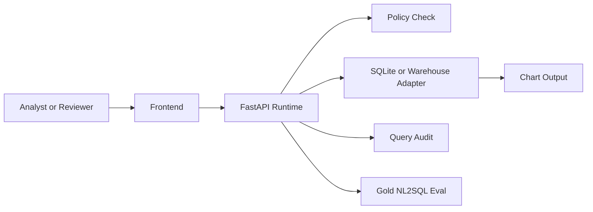

# Nexus-Hive Solution Architecture

## Goal

Nexus-Hive delivers governed analytics by turning natural-language questions into audited SQL, policy-reviewed execution, and reviewable chart output.

## System boundary

- browser UI for analysts and reviewers
- FastAPI runtime for ask, policy, audit, and eval surfaces
- warehouse and semantic model
- audit log and review summary layer

## Deployment topology

## Reliability posture

- every request can emit a stable `request_id`
- policy preview exists before execution
- fallback SQL and chart generation preserve the review path when model runtime degrades
- gold eval suite provides a deterministic governed-analytics baseline

## What makes this useful for an AI engineer

- NL2SQL guardrails
- fallback handling
- request-level audit
- evaluation-backed query quality

## What makes this useful for a solutions architect

- clear data plane vs policy plane separation
- semantic and policy surfaces are explicit
- governed review path is available without trusting live generation blindly
- rollout path to warehouse adapters is visible

## Production hardening next steps

- add warehouse-specific adapters and secrets profiles
- add row-level access simulation per role
- add signed audit export for external reviewers
- add deployment topology docs for private warehouse networking
